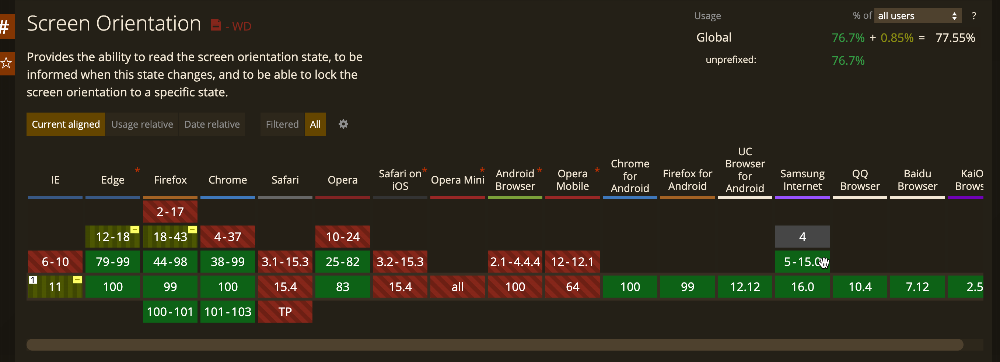
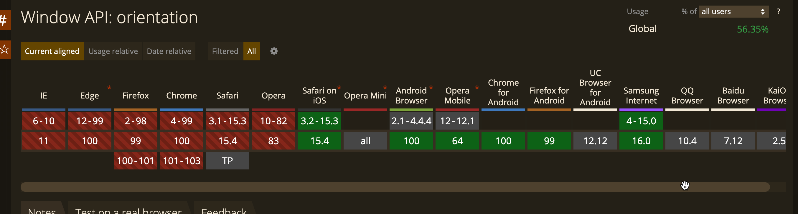
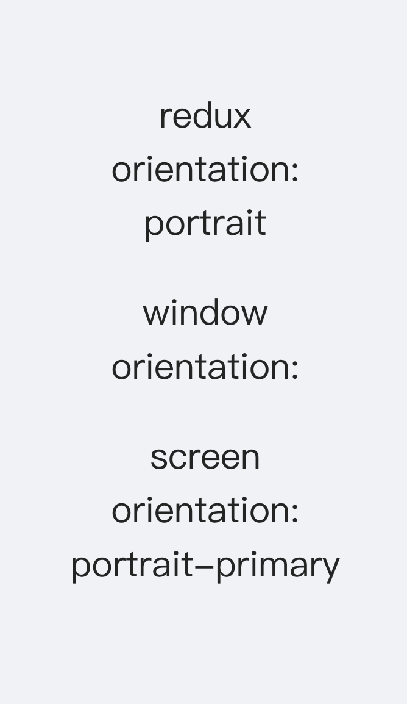
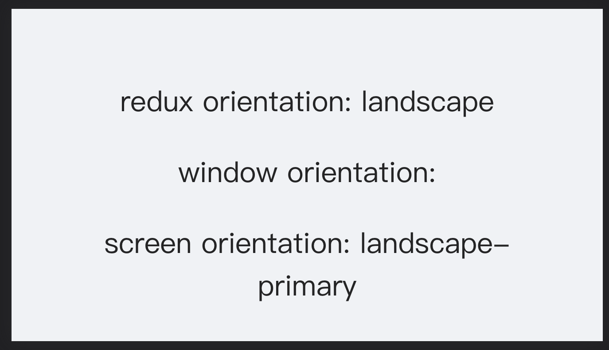
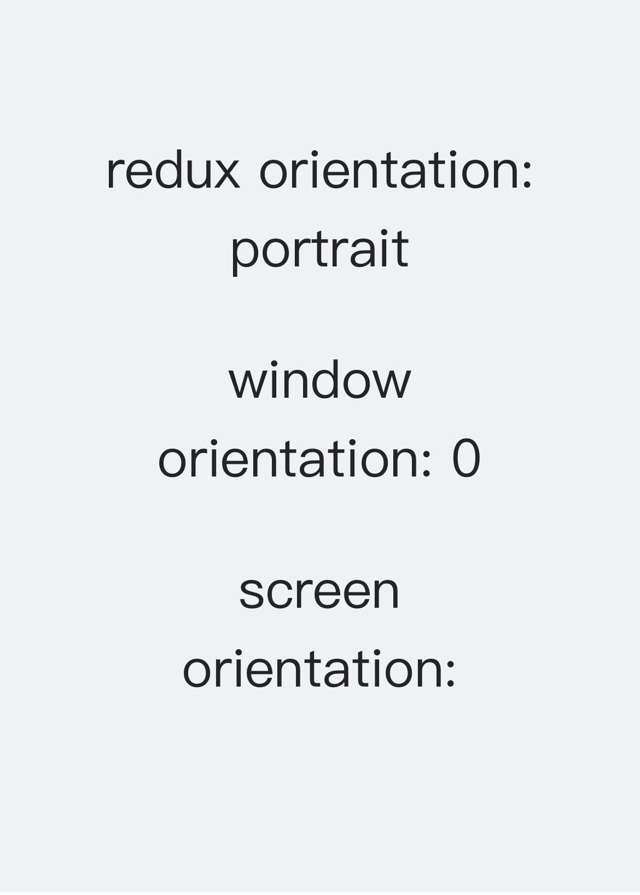
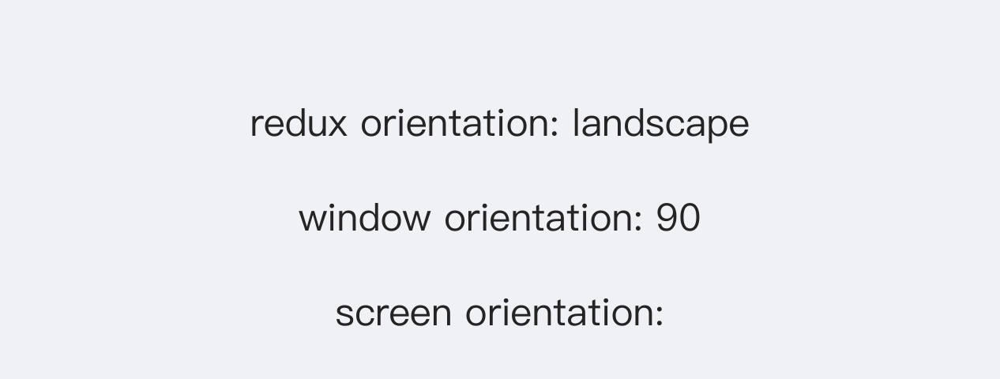

## 背景

直播产品的直播页面分为两种布局，当手机设备横过来的时候需要切换为一种类似全屏的布局，所以需要在产品的各个组件中判断是否是横屏状态

## 思路

尝试使用window.screen相关API来监听设备屏幕的朝向，并使用redux和自定义hooks来全局应用朝向的样式和逻辑

## 实现

### Orientation API

目前的W3C标准下，判断方向的api是screen orientation，兼容范围如下


可见，Safari on iOS完全不兼容该api，覆盖率仅有76.7%，所以必须要同时兼容更旧的window.orientation API



两个api都兼容的话即可满足绝大部分情况下的方向监听要求

### 自定义Hooks

首先实现一个监听用的自定义hooks

```javascript
// useListenOrientation.js

import {useEffect} from 'react'
import {useDispatch, useSelector} from 'react-redux'
import useOrientation from '@/hooks/useOrientation'

// 判断是否支持window上的orientation api，当不支持screen.orientation时进行检查，如果window上的也不支持，则不支持横屏样式
const supportOrientation = () => (typeof window.orientation === 'number' && typeof window.onorientationchange === 'object')


const useListenOrientation = () => {

  // 存储的orientation字段
  const [orientation] = useOrientation()

  const dispatch = useDispatch()

  // 触发screen.orientation变化时的事件，为了防止支持不完全的浏览器触发的事件e当中拿不到改变后的值，直接从screen对象中取出当前的方向type
  const checkScreenOrient = (e) => {

    console.log('screen orient change:', e)

    const newType = window.screen.orientation.type

    if (newType) {
      // type的值可能为 "portrait-primary", "portrait-secondary", "landscape-primary", 或 "landscape-secondary"
      // 其中portrait和landscape表示是横屏还是竖屏， primary还是secondary表示是标准的横屏或竖屏还是180度反过来的横屏或竖屏
      const orient = newType.toLowerCase().indexOf('landscape') > -1 ? 'landscape' : 'portrait'

      if (orient !== orientation) {
        // 因为屏幕翻转在手机上往往有一个动画效果，在动画效果结束之前orientation改变了，但是屏幕的长宽还没有改变，直接修改的话有可能导致某些要根据变化后的尺寸计算的逻辑出错，因此设置一定延时
        setTimeout(() => {
          dispatch.app.setOrientation(orient)
        }, 100)
      }
    }
  }

  // 触发screen.orientation变化时的事件
  const checkWindowOrientation = (e) => {

    console.log('orient change：', e)

    // window.orientation往往是数字, 四个可能的值为-90, 0, 90, 和 180，对应左转横屏，正常，右转横屏和倒转的方向
    const windowOrient = window.orientation

    let newOrient

    if([90, -90].includes(windowOrient)) { // 横屏
      newOrient = 'landscape'
    } else {
      newOrient = 'portrait'
    }

    if(newOrient !== orientation) {
      // 原因同上
      setTimeout(() => {
        dispatch.app.setOrientation(newOrient)
      }, 100)
    }
  }


  // 初始化hooks的时候直接执行一遍检查，进行初始化
  useEffect(() => {
    if (window.screen.orientation) {
      checkScreenOrient(window.screen.orientation)
    } else if(supportOrientation()) {
      checkWindowOrientation()
    }

  }, [])

  // 当orientation变化时重新绑定事件，因为检查事件中为了不重复赋值需要判断redux的orientation和新获得的值是否一致
  useEffect(() => {
    if (window.screen.orientation) {
      window.screen.orientation.onchange = checkScreenOrient

      return () => {
        window.screen.orientation.onchange = () => {}
      }
    } if(supportOrientation()) {
      window.addEventListener('orientationchange', checkWindowOrientation)

      return () => {
        window.removeEventListener('orientationchange', checkWindowOrientation)
      }
    }
    // const matchMedia = window.matchMedia('')
  }, [orientation])


  return [orientation]
}


export default useListenOrientation

```

然后编写给所有需要知道当前的方向的React组件来获取当前方向的hooks
```javascript
// useOrientation.js

import {useSelector} from 'react-redux'

const useOrientation = () => {

  const [orientation] = useSelector(state => [state.app.orientation])

  // 为了方便判断，将是否横屏放在内部判断，多返回一个字段即可
  const isLandscape = orientation === 'landscape'

  return [orientation, isLandscape]
}

export default useOrientation

```


### 测试页面

```javascript
// OrientationTest.js
import React, {useEffect, useState} from 'react'
import useListenOrientation from '@/hooks/useListenOrientation'
import s from './index.module.less' // 样式使用的是cssModule


const OrientationTest = (props) => {

  const [orientation] = useListenOrientation()
  

  return <div className={s.wrapper}>
    <div>redux orientation: {orientation}</div>
    <div>window orientation: {window.orientation}</div>
    <div>screen orientation: {window.screen.orientation?.type}</div>
    <div style={{fontSize: 12}}>{event}</div>
  </div>
}

export default OrientationTest


```

效果：

> 使用的浏览器是Google Chrome 100
> 
>竖屏时：

>横屏时：


> 使用的浏览器是Safari On iOS
>
>竖屏时：

>横屏时：



<br>
<br>
<br>  
参考

- [1] [MDN Web Docs - Screen.orientation](https://developer.mozilla.org/zh-CN/docs/Web/API/Screen/orientation)
- [2] [MDN Web Docs - Window.orientation](https://developer.mozilla.org/en-US/docs/Web/API/Window/orientation)
